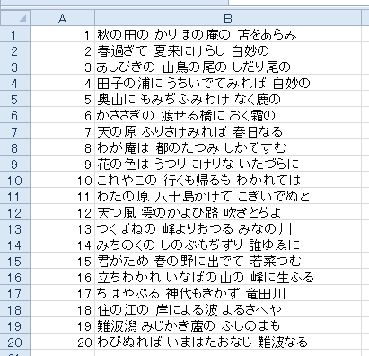
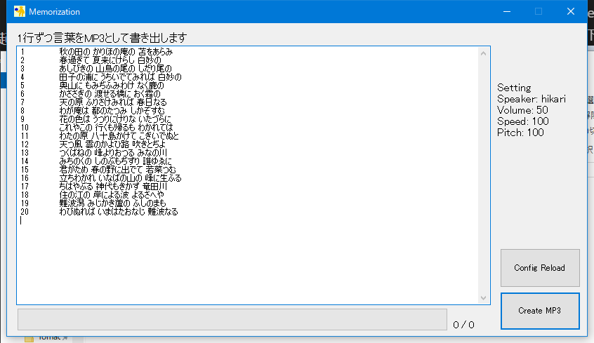

# Memorization

[VoiceText Web API](https://cloud.voicetext.jp/webapi)を使って、打ち込まれた文章を読み上げるmp3ファイルを生成します。

## ダウンロード

[Releases](https://github.com/book000/Memorization/releases)

## 使い方

1. [初期設定](#初期設定)をする。
2. Memorization.exeを起動する。
3. Excelなどで、以下のようにファイル名と読み上げるテキストの表を作る。
  
4. 作った表をコピーし、以下画像のように貼り付ける
  
5. Create MP3をクリックしファイルを生成
6. 完了と表示されたら成功。
7. アプリケーションと同じフォルダにあるoutputフォルダに生成したMP3ファイルがあるので必要に応じ移動などする。

## 初期設定

1. [VoiceText Web APIの「はじめる」](https://cloud.voicetext.jp/webapi/docs/introduction)を見ながら、利用登録をし、APIキーを取得する。
1. Memorization.exeを起動し、Apikeyの設定要求が出たらOKを押し閉じる。
2. Memorization.exeと同じフォルダにあるsettings.xmlをUTF-8で開く
3. `<Apikey>ENTER YOUR APIKEY HERE</Apikey>`とあるところの`ENTER YOUR APIKEY HERE`を消し、先ほど取得したAPIキーをペーストする。
4. 保存し、エディターを閉じる。
5. 再度Memorization.exeを起動し、正常に起動すれば成功。

## その他設定

VoiceText Web APIが定めるパラメータによって、生成する音声の種類を変更できます。  
設定可能なパラメータは後述する表か[こちら](https://cloud.voicetext.jp/webapi/docs/api#section-3)からご確認ください。  
設定はMemorization.exeと同じフォルダに生成されるsettings.xmlで設定できます。

1. settings.xmlを開く
2. 話者(Speaker)を変えるならば、`<Speaker>show</Speaker>`のところを`<Speaker>haruka</Speaker>`などに変更する。
3. 保存し、エディターを閉じる
4. Memorization.exeを起動していないのであれば起動して完了、すでに起動しているのなら画面右下の「Config Reload」で設定を反映して完了。

### 設定表

Apikeyの設定は前述しておりますので、省略します。  
最新のパラメータや詳しい説明は[こちら](https://cloud.voicetext.jp/webapi/docs/api#section-3)からご確認ください。

|パラメータ|説明|設定可能値|初期値|
|:-:|:-:|:-:|:-:|
|Speaker|話者名|show, haruka, hikari, takeru, santa, bear|show|
|Volume|音量|50%～200%|50%|
|Speed|話速|50%～400%|120%|
|Pitch|ピッチ|50%～400%|120%|

(emotion, emotion_levelは設定できません)

## 使用ライブラリ

制作にあたり、以下ライブラリを使用しております。ライブラリの作者様に感謝いたします。

- [VoiceText WebAPI Client for .NET (VoiceTextWebAPI.Client)](https://github.com/jsakamoto/voicetext-webapi-client4net) version 3.0.0.1

## ライセンス

当アプリケーションには[MIT License](https://github.com/book000/Memorization/blob/master/LICENSE)を適用します。

## 免責事項

作者(Tomachi)は、当アプリケーションを利用したことによる如何なる問題に対して責任を負いません。
